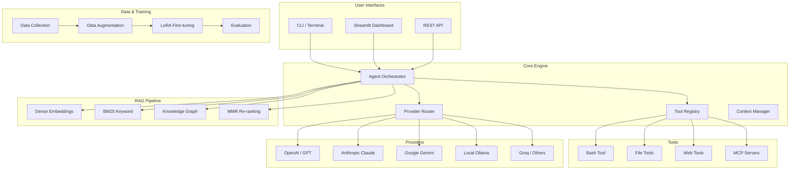

<div align="center">
  

  # 🚀 PythonAI
  **The Next-Generation Multi-Agent AI System**

  [](https://python.org)
  [](https://github.com/yourusername/PythonAI/actions/workflows/ci.yml)
  [](#license)

  <p align="center">
    <em>Orchestrate a swarm of specialized AI agents, execute tools, connect with MCP servers,
    fine-tune models, and chat with your documents using Hybrid RAG — all from one unified system.</em>
  </p>
</div>

---

## ✨ Features

| Capability | Description |
|---|---|
| 🤖 **Agent Swarm** | Dispatch goals to a collaborative swarm of specialized sub-agents (Orchestrator, Coder, Researcher, Reviewer) |
| 🧠 **Multi-Provider LLM Routing** | Intelligent load-balancing across OpenAI, Anthropic, Gemini, Groq, DeepSeek, Mistral, and local Ollama |
| 🔌 **MCP Integration** | Connect external MCP servers for extended capabilities via the Model Context Protocol |
| 🛠️ **Tool System** | Extensible registry with bash, file read/write/edit, glob, grep, web fetch/search, and calculator tools |
| 📚 **Hybrid RAG** | Dense embeddings (sentence-transformers) + BM25 keyword search + Knowledge Graph + MMR diversity |
| 🏋️ **Training Pipeline** | LoRA/QLoRA fine-tuning with checkpoint management, evaluation, and visualization |
| 📊 **Dataset Generation** | Generate SFT training data from 10+ API providers (Groq, OpenRouter, OpenAI, DeepSeek, etc.) |
| 🔍 **Discovery Engine** | Auto-discover datasets from HuggingFace, arXiv, GitHub, and government portals |
| 🚢 **FastAPI Server** | Production-grade REST API with rate limiting, health checks, and OpenAPI docs |
| 💻 **Streamlit Web UI** | Full-featured dashboard with RAG Chat, Agent Workspace, Provider Routing, Tool System, and MCP views |
| 🐳 **Docker Support** | Multi-stage Dockerfile + docker-compose with health checks and resource limits |
| 🔐 **Auth System** | Built-in authentication with login/logout/check commands |

---

## 🏗️ Architecture



---

## 🚀 Quick Start

### Prerequisites
- Python 3.10 or higher
- [Ollama](https://ollama.ai) (optional, for local models)

### Installation

```bash
# Clone & enter
git clone https://github.com/yourusername/PythonAI.git
cd PythonAI

# Virtual environment
python -m venv .venv
source .venv/bin/activate  # Windows: .venv\Scripts\activate

# Install dependencies
pip install -r requirements.txt

# Copy env template
cp .env.example .env
# Edit .env with your API keys
```

### Run

```bash
# CLI — ask a question with RAG
python -m src.cli ask "What is async/await in Python?"

# CLI — interactive mode with tools
python -m src.cli ask --tools

# Web UI Dashboard
make webui
# OR: streamlit run src/webui/app.py --server.port 8501

# API Server
make serve
# OR: python -m src.cli serve --port 8765
```

---

## 💻 Developer Guide

### Setup Dev Environment

```bash
# Install dev dependencies
make dev

# Install pre-commit hooks
pre-commit install

# Run all checks
make check
```

### Available CLI Commands

| Command | Description |
|---|---|
| `ask` | Ask the RAG assistant or use tool-calling mode |
| `serve` | Start the FastAPI server |
| `webui` | Launch the Streamlit dashboard |
| `train` | Run local LoRA/QLoRA training |
| `eval` | Evaluate a fine-tuned adapter |
| `augment` | Generate extra SFT rows with Ollama |
| `hf-collect` | Download datasets from HuggingFace |
| `provider` | Manage LLM provider routing |
| `mcp` | Manage MCP server connections |
| `discovery` | Auto-discover datasets |
| `status` | Show project, hardware, and model status |
| `apikeys` | Manage API keys |
| `login` | Authentication management |

### Testing

```bash
# All tests
make test

# Quick smoke tests
make test-quick

# With coverage
make test-cov
```

### Code Quality

```bash
# Lint
make lint

# Auto-format
make format

# Type check
make typecheck

# Full gate (lint + typecheck + test)
make check
```

---

## 🐳 Docker Deployment

```bash
# Build and start
make docker-build
make docker-up

# Dev mode with hot-reload
docker compose -f docker-compose.yml -f docker-compose.override.yml up

# Stop
make docker-down
```

---

## 🧠 Hybrid RAG Pipeline

PythonAI uses a triple-hybrid search strategy:

1. **Dense Embeddings** — Sentence-transformers (`all-MiniLM-L6-v2`) for semantic similarity
2. **BM25 Keyword Search** — Custom implementation for exact term matching
3. **Knowledge Graph** — Entity-relationship graph for context-aware retrieval

Optional enhancements:
- **Query Expansion** — Generate alternative phrasings for broader coverage
- **MMR Diversity** — Maximum Marginal Relevance to avoid redundant results
- **Metadata Filtering** — Filter by Python version or category

---

## 🤖 Agent System

The agent swarm supports multiple agent types:

| Agent | Role |
|---|---|
| **Orchestrator** | Plans tasks, delegates to sub-agents, synthesizes results |
| **Coder** | Writes, reviews, and debugs code |
| **Researcher** | Gathers context from files and web |
| **Reviewer** | Quality-checks outputs |
| **Teacher** | Generates educational explanations |
| **Performance** | Optimizes code and system performance |

---

## 🏋️ Training Pipeline

End-to-end fine-tuning workflow:

```bash
# 1. Collect data
python -m src.cli hf-collect --list

# 2. Augment dataset
python -m src.cli augment --limit 50 --merge

# 3. Train (smoke test)
python -m src.cli train --mode smoke --max-steps 10

# 4. Train (full)
python -m src.cli train --mode qwen --max-steps 500

# 5. Evaluate
python -m src.cli eval --adapter-path checkpoints/local_auto_model

# 6. Export
python -m src.cli export --format gguf
```

---

## 🔗 Provider Support

| Provider | Requires Key? | Models |
|---|---|---|
| OpenAI | Yes | GPT-4o, GPT-4o-mini, o1, o3 |
| Anthropic | Yes | Claude 3.5 Sonnet, Claude 3 Opus |
| Google Gemini | Yes | Gemini 1.5 Pro, Gemini 1.5 Flash |
| DeepSeek | Yes | DeepSeek-V3, DeepSeek-R1 |
| Groq | Yes | Llama 3.3, Mixtral, Gemma (free tier!) |
| Mistral | Yes | Mistral Large, Mistral Small |
| Ollama | No (local) | Qwen, Llama, Mistral, DeepSeek Coder |
| OpenRouter | Yes | Aggregator for 200+ models |
| Together AI | Yes | Llama, Mixtral, DeepSeek |

---

## 📊 Performance Metrics

Built-in metrics collection:
- API request latency (p50/p95/p99)
- RAG query performance
- Provider call success rates
- Tool execution times

Access via: `GET /metrics` on the API server.

---

## 🔒 Security

- **Input sanitization** — Control character stripping, length limits, pattern validation
- **Docker non-root user** — Runs as `pythonai` user in containers
- **Rate limiting** — Token bucket per IP (configurable)
- **Security headers** — X-Content-Type-Options, X-Frame-Options, X-XSS-Protection
- **Code execution safety** — Dangerous pattern detection before running code
- **API key validation** — Format checking per provider

---

## 📁 Project Structure

```
PythonAI/
├── src/
│   ├── api/          # FastAPI REST server
│   ├── agents/       # Agent implementations
│   ├── core/         # Core engine (tools, providers, MCP, registry)
│   ├── data/         # Data collection, augmentation, generation
│   ├── rag/          # RAG pipeline (search, reasoning, verification)
│   ├── training/     # Fine-tuning pipeline
│   ├── webui/        # Streamlit dashboard
│   └── utils/        # Logging, metrics, validation, models
├── scripts/          # Utility scripts (collection, forge pipeline)
├── tests/            # Test suite
├── configs/          # Configuration files
├── docs/             # Documentation
├── tools/            # External tool integrations
├── data/             # Data directory (gitignored)
└── checkpoints/      # Model checkpoints (gitignored)
```

---

## 🛤️ Roadmap

- [x] **Phase 1-4** — Data collection, cleaning, augmentation pipeline
- [x] **Phase 5** — Hybrid RAG engine (Dense + BM25 + KG)
- [x] **Phase 6** — Agent orchestration and sub-agent system
- [x] **Phase 7** — LLM-based planning and synthesis
- [x] **Phase 8** — Training pipeline (LoRA/PEFT)
- [x] **Phase 9** — FastAPI deployment and serving
- [x] **Phase 10** — UI polish and final integration

---

## 📚 Documentation

Additional docs in `docs/`:
- [RAG Engine](docs/RAG_ENGINE.md)
- [Training Pipeline](docs/TRAINING_PIPELINE.md)
- [Agent Swarm](docs/AGENT_SWARM.md)
- [Data Pipeline](docs/DATA_PIPELINE.md)
- [Deployment Guide](docs/DEPLOYMENT.md)
- [Master Dashboard](docs/MASTER_DASHBOARD.md)

---

## 🤝 Contributing

1. Fork the repository
2. Create a feature branch (`git checkout -b feature/amazing`)
3. Install dev dependencies (`make dev`)
4. Install pre-commit hooks (`pre-commit install`)
5. Make your changes
6. Run tests (`make check`)
7. Commit and push
8. Open a Pull Request

See [CONTRIBUTING.md](docs/CONTRIBUTING.md) for detailed guidelines.

---

## 📄 License

MIT License — see [LICENSE](LICENSE) for details.

---

<div align="center">
  <i>Built with ❤️ for the future of Agentic AI.</i>
</div>
