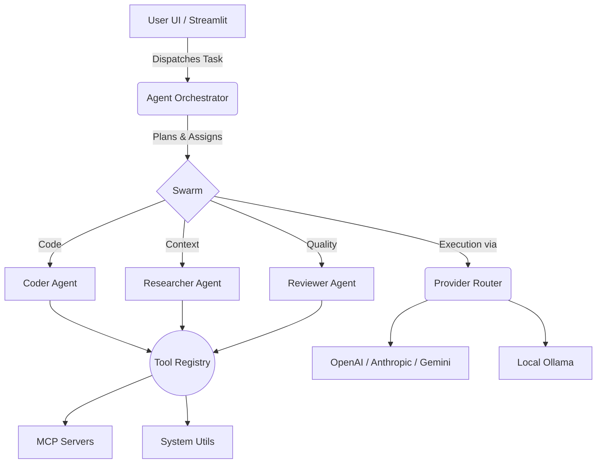

<div align="center">
  
  
  # 🚀 PythonAI  
  **The Next-Generation Multi-Agent AI System & Streamlit Dashboard**
  
  [](https://python.org)
  [](https://streamlit.io)
  [](#license)
  
  <p align="center">
    <em>Orchestrate a swarm of specialized AI agents, visualize tool execution, connect with MCP servers, and chat with your documents using advanced Hybrid RAG — all from one unified, sleek dashboard.</em>
  </p>
</div>

---

## ✨ Features

- 🔮 **Agent Swarm Workspace**  
  Dispatch complex goals to a collaborative swarm of specialized sub-agents (*Orchestrator, Coder, Researcher, Reviewer*). Watch them plan, execute tools, and synthesize solutions in real-time.

- 🧠 **Advanced Provider Routing**  
  Intelligent load-balancing and automatic fallbacks across multiple LLM providers (*OpenAI, Anthropic, Gemini, Groq, and local Ollama models*). Dynamically routes traffic based on speed, cost, or quality.

- 🔌 **MCP (Model Context Protocol) Integration**  
  Connect seamlessly to external MCP servers to extend the AI's capabilities natively. View server status, available tools, and connection health directly in the dashboard.

- 🛠️ **Dynamic Tool System**  
  An extensible tool registry that allows the AI to perform web searches, write files, run code, and execute custom scripts. Visualize live tool metrics and execution history.

- 📚 **Hybrid RAG Chat**  
  Chat intelligently with your local knowledge base using a state-of-the-art Hybrid RAG pipeline combining Dense Embeddings and BM25 search with MMR diversity.

---

## 📸 Screenshots

<div align="center">
  
  <p><em>Interactive Agent Swarm Workspace</em></p>
</div>

---

## 🚀 Quick Start

### 1. Prerequisites
- Python 3.10 or higher
- [Ollama](https://ollama.ai) (optional, for local models)

### 2. Installation

Clone the repository and set up a virtual environment:

```bash
git clone https://github.com/yourusername/PythonAI.git
cd PythonAI
python -m venv .venv
source .venv/bin/activate  # On Windows use: .venv\Scripts\activate
pip install -r requirements.txt
```

### 3. Launch the Dashboard

Start the comprehensive Streamlit UI:

```bash
python -m streamlit run src/webui/app.py --server.port 8501
```

Visit `http://localhost:8501` in your browser to access the PythonAI hub.

---

## 🏗️ Architecture overview



---

## 🔒 Environment Setup

Create a `.env` file in the project root to configure your API keys:

```env
OPENAI_API_KEY=your_key_here
ANTHROPIC_API_KEY=your_key_here
GEMINI_API_KEY=your_key_here
GROQ_API_KEY=your_key_here
```

---

<div align="center">
  Built with ❤️ for the future of Agentic AI.
</div>
