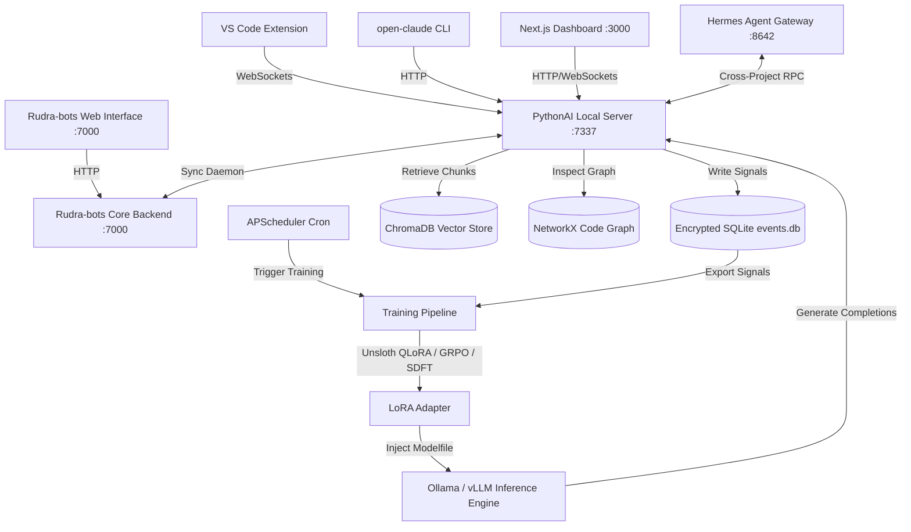

# ⚡ FORGEAI ECOSYSTEM — THE ULTIMATE MASTER REFERENCE

> **"Jo AI static rahega woh mortal hai. Jo AI seekhta hai woh immortal hai. ForgeAI seekhta hai."**

Welcome to the central control plane and documentation index for the **ForgeAI Ecosystem**, the world's first self-improving, privacy-first, on-premise multi-agent developer platform. ForgeAI continually fine-tunes itself using accepted code suggestions from developers, building a model that aligns with your team's custom patterns and coding styles without leaking any data to public clouds.

---

## 🌍 Table of Contents
1. [System Topology & Architecture](#-system-topology--architecture)
2. [Ecosystem Project Directories](#-ecosystem-project-directories)
3. [Research & Foundational Science](#-research--foundational-science)
4. [Component Microservices & Ports](#-component-microservices--ports)
5. [Signal Collection & Training Dataflows](#-signal-collection--training-dataflows)
6. [Ecosystem Installation & Quick Start](#-ecosystem-installation--quick-start)
7. [Directory Tree Map (A-to-Z)](#-directory-tree-map-a-to-z)

---

## 🏗️ System Topology & Architecture

ForgeAI operates on a multi-layer topology combining local developer interfaces, local microservices, an encrypted database, and offline inference/training loops.



### Architectural Layers

1. **User Interfaces (Layer 1):** 
   - **VS Code Extension:** Intercepts inline completion accept/reject signals and interacts with the chat system.
   - **Terminal CLI (`open-claude`):** Standard developer interface for terminal-based tasks.
   - **Next.js Dashboard (`dashboard`):** Unified visualization dashboard showing metrics, charts, training history, and RAG status.
2. **Agent Orchestration (Layer 2):**
   - **Hermes Agent:** Handles crew-based multi-agent coordination, permissions, cron job management, and custom task execution.
3. **Core Engine (Layer 3 - `PythonAI`):**
   - **Capture Engine:** Encrypts and stores signal context to local SQLite database.
   - **cAST RAG:** Structures and retrieves codebase chunks contextually using Abstract Syntax Trees.
   - **Training Pipeline:** Executes QLoRA, GRPO, and SEAL fine-tuning loops.
4. **Infrastructure (Layer 4):**
   - **Local Inference Servers:** Ollama (default), vLLM, or SGLang for serving customized adapters and base models.

---

## 📁 Ecosystem Project Directories

The ForgeAI repository compiles various modular projects working in harmony:

| Project Directory | Role / Subsystem | Technology Stack |
| :--- | :--- | :--- |
| [**PythonAI**](file:///c:/Users/lucky_vv7fub/OneDrive/Desktop/Today%201%20June/PythonAI) | Core Engine (RAG, Training, Capture DB) | Python, PyTorch, Transformers, Tree-sitter, SQLite |
| [**dashboard**](file:///c:/Users/lucky_vv7fub/OneDrive/Desktop/Today%201%20June/dashboard) | Next.js Web Dashboard | Next.js 14, React, TailwindCSS, Recharts, Zustand |
| [**hermes-agent-main**](file:///c:/Users/lucky_vv7fub/OneDrive/Desktop/Today%201%20June/hermes-agent-main) | Multi-Agent Orchestration & Skills | Python, FastAPI, TUI, CLI |
| [**Rudra-bots-main**](file:///c:/Users/lucky_vv7fub/OneDrive/Desktop/Today%201%20June/Rudra-bots-main) | Self-Hosted Workspace Platform (Odysseus) | Python, FastAPI, SQLite, React, Modular Frontend |
| [**open-claude-main**](file:///c:/Users/lucky_vv7fub/OneDrive/Desktop/Today%201%20June/open-claude-main) | Coding-Agent CLI Interface | TypeScript, Node.js, Bun |
| [**skills-main**](file:///c:/Users/lucky_vv7fub/OneDrive/Desktop/Today%201%20June/skills-main) | Agent Skills CLI Ecosystem | TypeScript, Node.js, CLI |
| [**Claude_Code_npm-main**](file:///c:/Users/lucky_vv7fub/OneDrive/Desktop/Today%201%20June/Claude_Code_npm-main) | Reference Architecture (Leaked Claude Code source) | TypeScript, Ink, React |
| [**superview-sh-main**](file:///c:/Users/lucky_vv7fub/OneDrive/Desktop/Today%201%20June/superview-sh-main) | Competitor Intelligence & Guidelines | Shell, Markdown |
| [**Readme**](file:///c:/Users/lucky_vv7fub/OneDrive/Desktop/Today%201%20June/Readme) | Specification Documents, PRD, TRD, AppFlow | Markdown |
| [**arsenal**](file:///c:/Users/lucky_vv7fub/OneDrive/Desktop/Today%201%20June/arsenal) | AI Foundational Repositories & Packages | Cloned repositories |

---

## 🔬 Research & Foundational Science

ForgeAI is built upon and directly implements findings from 6 major AI research papers:

> [!NOTE]
> **MIT SEAL (NeurIPS 2025):** Self-adapting language models utilizing an inner SFT loop (generating training edits) and an outer RL loop using downstream accept rates as rewards.
>
> **cAST (EMNLP 2025):** Structural chunking via Abstract Syntax Tree boundaries, giving +4.3 Recall@5 over line-based chunking by preserving code scopes (functions, classes, blocks).
>
> **GRPO (DeepSeek 2025):** Group Relative Policy Optimization, allowing RL instruction optimization using verifiable reward signals (tests passing, compiler checks, syntax validity) without requiring a separate reward model.
>
> **SDFT (MIT 2026):** Sequential learning without catastrophic forgetting, retaining 98% of baseline knowledge by maintaining a 70/20/10 training buffer mixture (current/previous/foundational).
>
> **QLoRA (UW 2023):** 4-bit NormalFloat (NF4) quantized fine-tuning, reducing VRAM usage by 70% to make consumer-GPU fine-tuning accessible.
>
> **Unsloth (2025):** High-efficiency Triton kernels, accelerating fine-tuning speeds by 2x while further decreasing memory overhead.

---

## 🔌 Component Microservices & Ports

When the ecosystem is fully activated, the following microservices run locally:

| Port | Service Name | Subsystem | Description |
| :--- | :--- | :--- | :--- |
| **7337** | PythonAI Backend Server | `PythonAI` | FastAPI core exposing RAG, training trigger, and event capture APIs. |
| **3000** | Next.js Dashboard | `dashboard` | Next.js development server serving the main visualization dashboard. |
| **7000** | Rudra-bots Server | `Rudra-bots-main` | Odysseus FastAPI backend coordinating document edits, email sync, and workspace settings. |
| **8642** | Hermes Gateway | `hermes-agent-main`| Multi-agent planning, SSE chat streaming, skill installation, and execution approvals API. |
| **8080** | SearXNG Server | `Rudra-bots-main` | Self-hosted search engine API for Deep Research. |
| **8100** | ChromaDB Server | `Rudra-bots-main` | Standalone Vector DB instance for Odysseus memory storage. |
| **11434** | Ollama Local Inference | Local Host | Local model inference provider. |

---

## 🔄 Signal Collection & Training Dataflows

### 1. The Capture Cycle (Developer Actions → SQLite DB)
- **Inline Interception:** VS Code extension intercepts Tab (Accept) and Esc (Reject).
- **Edit Tracker:** If a suggestion is modified, edit distance is computed to adjust training weight.
- **SQLite Storage:** Context (512 tokens), code changes, languages, and weights are saved locally to an encrypted SQLite database.

### 2. cAST RAG Indexing Flow
- **AST Parsing:** Tree-sitter parses the repository's files to detect semantic scope boundaries (methods, functions, classes).
- **Multi-View Embedding:** Each chunk is converted into three embedding vectors: code content, docstring/comments, and method signature.
- **Hybrid Search:** Queries are resolved by fusing BM25 sparse matching, dense semantic vector lookup, and NetworkX dependency graphs.

### 3. Weekly Training Loop
- **Trigger:** APScheduler runs a weekly cron job on Sunday at 2:00 AM.
- **SDFT Batching:** Creates a 70% current signals, 20% previous week, and 10% anchor set mixture.
- **QLoRA/Unsloth Training:** Fine-tunes the base model (e.g., Qwen 2.5 Coder 14B) in 4-bit precision.
- **Evaluation & Rollback Guard:** Simulates acceptance rate on a held-out test set. If metrics drop >10%, the previous adapter is auto-restored.

---

## 🚀 Ecosystem Installation & Quick Start

### One-Command Setup (Linux & macOS)

```bash
# Unpack the repository, navigate to the folder and run:
chmod +x setup_ecosystem.sh
./setup_ecosystem.sh --dev
```

### Step-by-Step Manual Startup (Windows PowerShell)

#### 1. Launch Ollama & Pull Models
```powershell
ollama serve
# In another terminal:
ollama pull qwen2.5-coder:7b
ollama pull qwen2.5-coder:14b
```

#### 2. Start PythonAI Server (Core Engine)
```powershell
cd PythonAI
.venv\Scripts\activate
python -m src.api.server
# Runs FastAPI backend on http://localhost:7337
```

#### 3. Start Next.js Dashboard
```powershell
cd dashboard
npm install
npm run dev
# Starts on http://localhost:3000
```

#### 4. Run Rudra-bots Platform (Odysseus)
```powershell
cd Rudra-bots-main
venv\Scripts\Activate.ps1
python setup.py
python -m uvicorn app:app --host 127.0.0.1 --port 7000
# Starts on http://localhost:7000
```

#### 5. Launch Hermes Gateway & Studio UI
```powershell
cd hermes-agent-main
.venv312\Scripts\activate
python -m gateway.gateway_server
# Starts agent gateway on port 8642
```

---

## 🗂️ Directory Tree Map (A-to-Z)

```
Today 1 June/
│
├── PythonAI/                           # Core learning, RAG and capture engine
│   ├── src/
│   │   ├── agents/                     # Code, debug, doc and teacher agents
│   │   ├── api/                        # FastAPI REST server & WebSockets
│   │   ├── learning/                   # Signal collection, PR merges, test integrations
│   │   ├── training/                   # QLoRA, GRPO and SEAL trainers with SDFT replay
│   │   ├── rag/                        # AST chunker, hybrid retriever, knowledge graphs
│   │   └── integration/                # Rudra-bots metrics sync and gateway routes
│   ├── vscode-extension/               # Source for VS Code plugin
│   └── docs/                           # Core engine implementation runbooks
│
├── dashboard/                          # Next.js 14 frontend analytics interface
│   ├── src/app/                        # Next.js route components (monitor, seal, training)
│   ├── src/components/                 # Shimmer skeletons, Recharts visualizers
│   └── src/lib/                        # React Query API fetch wrappers and WebSockets
│
├── hermes-agent-main/                  # Crew-based multi-agent orchestration framework
│   ├── agent/                          # Planning, tool execution loops
│   ├── skills/                         # Custom agent routines
│   └── tools/                          # Files, shell and Git execution drivers
│
├── Rudra-bots-main/                    # Odysseus self-hosted ChatGPT/Claude interface clone
│   ├── routes/                         # FastAPI routes for notes, calendar, emails
│   ├── services/                       # Background task runners and document indexers
│   └── static/                         # React/JS modular frontend app assets
│
├── open-claude-main/                   # Coding CLI agent for cloud/local models
│   ├── src/                            # TypeScript source (tools, CLI, REPL launcher)
│   └── vscode-extension/               # Launch integration extension
│
├── skills-main/                        # Open agent skills package registry manager
│   ├── src/                            # TypeScript source for adding/listing/updating skills
│   └── skills/                         # Pre-configured skill templates
│
├── Claude_Code_npm-main/               # Leaked Claude Code TypeScript source map extracts
│   ├── QueryEngine.ts                  # Core LLM token and prompt manager
│   ├── Tool.ts                         # System tool definitions
│   └── commands/                       # Slash command actions
│
└── Readme/                             # Specification PRD, TRD and execution logs
    ├── 01_PRD (2).md                   # Product Requirements Document
    ├── 02_TRD (2).md                   # Technical Requirements Document
    ├── 03_AppFlow (1).md               # User journey mapping
    ├── 04_UIUXDesignBrief.md           # Visual dark/dense style guidelines
    ├── 05_BackendSchema.md             # Local SQLite database configurations
    └── 06_ImplementationPlan.md        # Weekly milestones checkbook
```

---

*Compiled by Antigravity AI | Bhopal → World | 2026*
**"ForgeAI seekhta hai."**