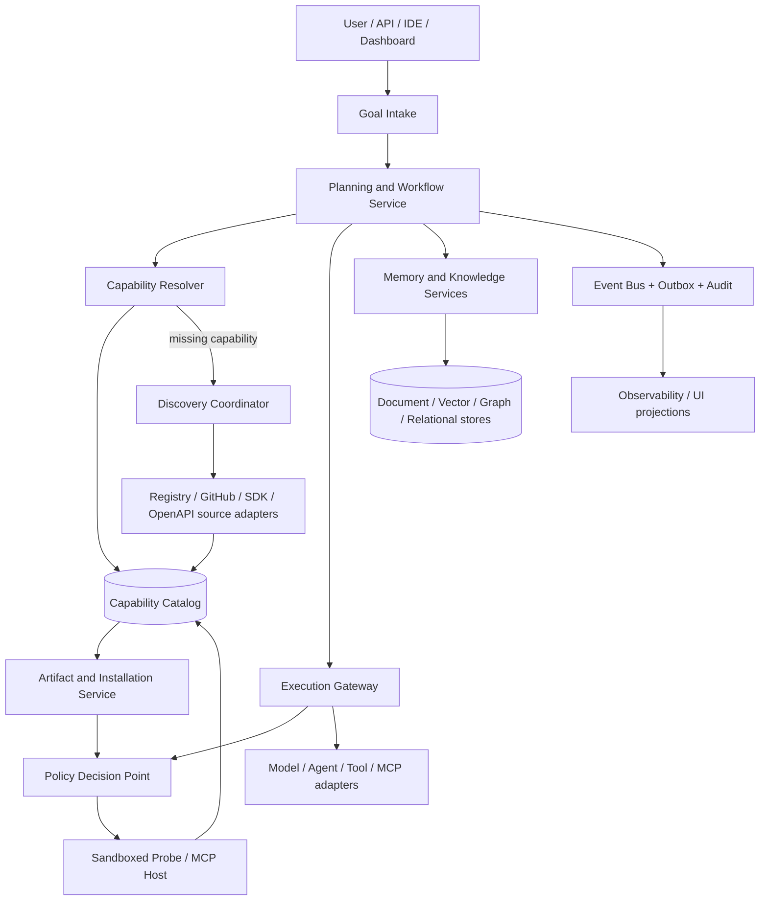
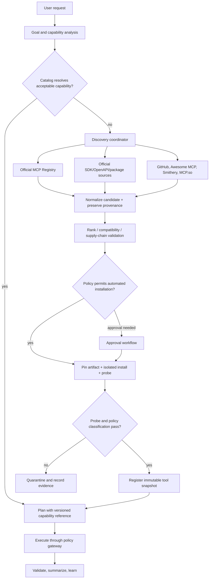

# ForgeAI Autonomous Brain — Target Architecture and Delivery Plan

**Status:** Phase 1 foundation in progress. The dependency-free extensibility
kernel and its Python 3.12 test suite are verified; the full legacy dependency
baseline remains a separate Phase 0 follow-up.

## Implementation checkpoint — 2026-07-23 to 2026-07-24

The first vertical slice is implemented under `PythonAI/src/brain/`:

- immutable capability, artifact, plugin, policy, event, and lifecycle
  contracts;
- a fail-closed policy engine, optimistic-concurrency catalog, in-memory test
  adapters, durable SQLite catalog/outbox adapter, resolver, and explicit
  composition root;
- policy action binding that prevents a lower-privilege decision from being
  substituted for an install/activation transition;
- emergency safety transitions that preserve tenant/workspace audit context;
- versioned plugin-manifest schema plus non-executing filesystem discovery that
  validates and hashes manifests without importing their entry points;
- MCP `server.json` static parser for package and remote metadata, including
  pinning, secret, runtime-argument, insecure-remote, and legacy-transport
  findings before any connection or package-manager action;
- an Official MCP Registry source adapter with an HTTPS host allowlist,
  bounded no-redirect metadata fetches, per-record validation, active versus
  deprecated status handling, and a successful read-only live discovery smoke
  test against the Registry API;
- a policy-gated MCP installation-planning boundary. It requires an exact
  artifact/endpoint selection, records separate digest and provenance evidence,
  requires a sandbox even when a broad policy would allow otherwise, and emits
  an audit-safe plan without raw launch arguments or secret values;
- a credential-free MCP probe acceptance contract that requires completed
  `initialize`, `tools/list`, `resources/list`, and `prompts/list` evidence;
  it produces a bounded, hash-addressed tool snapshot and rejects identity or
  transport mismatches, external JSON Schema references, and credential-bearing
  probes before tools can be exposed;
- a local-first SQLite capability catalog and durable outbox. When selected
  through the composition root, lifecycle record changes and their audit events
  commit atomically; the outbox supports deterministic pending-event polling
  and idempotent delivery acknowledgement;
- a dynamic workflow-planning kernel: decomposer-provided task definitions are
  validated as DAGs, resolve active agent/tool capabilities by requirement,
  preserve selected artifact provenance, and return a blocked plan rather than
  guessing or executing when any capability is missing;
- a sandboxed-MCP-probe boundary with an explicit runner port. Package probes
  receive no network, host filesystem, credentials, or privilege escalation;
  remote probes receive only their exact verified HTTPS origin. The runner's
  transcript still passes through the immutable tool-snapshot gate;
- a transport-neutral MCP host probe client that performs `initialize`, protocol
  and capability negotiation, `initialized`, health `ping`, bounded paginated
  tool/resource/prompt inventory, and transport shutdown. It passes the
  negotiated protocol revision to adapters for HTTP header enforcement;
- a plan-first MCP tool-execution gateway. Calls must reference a ready workflow
  task, immutable tool snapshot, active catalog capability, matching execution
  policy facts, and a sandboxed invoker; audit events store bounded payload
  hashes and sizes rather than raw inputs or untrusted outputs;
- a pluggable, read-only MCP package-artifact resolution gate. It verifies the
  exact package identity, HTTPS host allowlist, immutable digest, SBOM,
  provenance, normalized license metadata, and vulnerability threshold before
  producing evidence for installation planning;
- a tenant/workspace-isolated knowledge kernel with versioned source references,
  scoped content-addressed deduplication, deterministic chunking, trust-filtered
  retrieval, and hash/version-backed citations. Knowledge and retrieval output
  remain explicitly untrusted rather than executable instructions;
- fifty-seven standard-library tests, verified with the project-local Python
  3.12 virtual environment.

No plugin has been installed, imported, started, granted a secret, or connected
to an MCP server by this slice. A future installer may consume only a
`ready-for-sandbox` plan, and must still re-check the digest, install in an
isolated runtime, perform a credential-free MCP probe, and then request the
lifecycle activation transition.

## 1. Executive decision

ForgeAI should evolve as a **modular monolith with explicit ports, events, and
plugin contracts first**, not as a collection of directly coupled agent
features.  It will be deployable as a set of services later, but its first
production-grade version must be testable and operable as one cohesive runtime.

The platform has a small, stable kernel:

- domain contracts and versioned schemas;
- capability catalog and lifecycle state machine;
- policy decision point and audit trail;
- event envelope, idempotency, and workflow state;
- dependency-injection composition root.

Everything outside that kernel is an extension: models, agents, memory stores,
knowledge sources, connector types, MCP transports, installers, search sources,
embedders, schedulers, and UI integrations.  This preserves the requested
open/closed model without making security policy or core data contracts mutable
by arbitrary plugins.

## 2. Current-state audit

The repository already contains useful capabilities in `PythonAI`:

- MCP client/server/configuration and a tool registry;
- agent orchestrators and sub-agents;
- provider routing, RAG, memory, learning, auth, API, and monitoring modules;
- a FastAPI surface and a separate Next.js dashboard;
- more than seventy test files.

These must be reused through adapters, not copied.  However, the current code
also has traits that prevent it from being the autonomous-brain kernel:

- the global in-memory tool registry is a source of truth rather than a
  versioned, durable catalog;
- MCP configuration can reach process execution before an independent trust,
  artifact, and sandbox policy has been applied;
- planning, execution, registry, and provider selection are coupled directly;
- large CLI/API modules make safe extension difficult;
- the historical test-pass claim is not presently reproducible: `python` maps
  to the Microsoft Store alias and the available `py -3.14` interpreter has no
  `pytest` installed.

The migration rule is therefore: **wrap first, replace only after behavior is
covered by contract tests.**

## 3. Architecture principles

1. **Capability-first, not vendor-first.** A request asks for a capability;
   provider, package, MCP server, and agent are resolution details.
2. **Discover, install, and execute are separate trust domains.** Directory
   metadata is never proof that code or a remote endpoint is safe to execute.
3. **Policy before side effects.** A model may propose an action, but only the
   policy gateway may authorize it.
4. **Immutable observations; mutable projections.** Raw registry documents,
   probe results, tool snapshots, and audit events are retained. Read models may
   be rebuilt from events.
5. **Version every externally visible contract.** Plugins, MCP protocol
   revisions, artifact digests, tool snapshots, knowledge documents, and
   workflow definitions all have explicit versions.
6. **No capability is hardcoded into the planner.** Built-ins and extensions
   publish the same `CapabilityDescriptor` contract.
7. **Local-first, multi-tenant-ready.** A single-user developer installation is
   a supported deployment mode; tenant, principal, workspace, and data-boundary
   fields are nevertheless present from day one.
8. **Modular monolith before microservices.** Message contracts, an outbox, and
   anti-corruption layers give a clean later split without paying distributed
   systems cost on the first feature.

## 4. Target topology



There are three logical planes:

| Plane | Responsibility | Must not do |
|---|---|---|
| Control plane | Catalog, policy, installation, lifecycle, configuration, tenancy, audit | Run an unreviewed tool directly |
| Runtime plane | Workflows, agents, execution, retries, MCP connections, sandboxing | Decide its own privileges |
| Data plane | Knowledge, memory, artifacts, embeddings, event history, projections | Embed provider-specific business logic |

## 5. Core bounded contexts and ports

### 5.1 Capability Catalog

The catalog is the only authoritative source for capability availability.  It
stores a desired state separately from the installed and active states.

```text
candidate -> validated -> approved -> installing -> installed -> probing
          -> active -> degraded -> quarantined -> retired
```

Important entities:

- `CapabilityDescriptor`: semantic capability, input/output schemas, risk
  classification, quality signals, and provider-independent tags.
- `CapabilityCandidate`: an observation from a discovery source with provenance
  and its raw metadata snapshot.
- `PluginRelease`: manifest, package/OCI/remote endpoint, version, digest,
  license, SBOM, signatures, and compatibility range.
- `Installation`: workspace/tenant-specific resolved release and runtime policy.
- `ToolSnapshot`: immutable list of MCP tools/resources/prompts observed after
  a successful protocol negotiation.

Required ports:

```text
CapabilityCatalogPort
CandidateSourcePort
ArtifactResolverPort
ArtifactStorePort
CompatibilityEvaluatorPort
```

### 5.2 Policy, Trust, and Secrets

The Policy Decision Point (PDP) evaluates every installation, connection, and
tool invocation. Its decisions are deterministic, explainable, and recorded.

```text
PolicyDecision = allow | deny | require_approval | require_sandbox
```

Policy inputs include principal, tenant/workspace, request purpose, data
classification, plugin provenance, artifact digest, requested filesystem paths,
network destinations, secrets, tool risk level, and budget. The Policy
Enforcement Point (PEP) exists at the installer, MCP host, tool gateway, agent
worker, API, and scheduler.

Secrets are referenced by opaque handles in manifests. They are resolved only by
a secret broker at execution time; they are never written to catalog records,
event payloads, LLM context, logs, or plugin manifests.

### 5.3 Plugin Runtime

A plugin is an independently versioned package that implements a declared port.
It has a signed or integrity-pinned manifest and is loaded by a runtime adapter,
not by arbitrary import discovery.

```yaml
apiVersion: forgeai.dev/plugin/v1
kind: capability-provider
metadata:
  id: io.forgeai.mcp.official-registry
  version: 1.2.0
  publisher: forgeai
spec:
  provides:
    - capability.discovery.mcp
  runtime:
    type: python-worker # other types: container, wasm, remote, node-worker
  entrypoint: forgeai_mcp_registry.plugin:Plugin
  permissions:
    network:
      egress: [registry.modelcontextprotocol.io]
    filesystem:
      read: []
      write: []
  compatibility:
    kernel: ">=1.0,<2.0"
```

The manifest schema is versioned and validated before package installation.
Language-specific SDKs are adapters around this same manifest and RPC contract;
the platform itself is therefore language-agnostic.

### 5.4 MCP Host and Gateway

ForgeAI owns one managed connection per MCP server instance. It supports the
standard `stdio` and Streamable HTTP transports through a common port; legacy
SSE and WebSocket support are compatibility adapters. Supergateway may be
deployed as an optional sidecar for protocol conversion, but never as a
permission boundary.

MCP lifecycle:

```text
discover -> normalize -> static validate -> policy decision -> resolve/pin
-> isolated install -> credential-free probe -> initialize/version negotiation
-> tools/resources/prompts snapshot -> risk classify -> activate
-> monitor -> canary update | rollback | quarantine | retire
```

The probe must use a disposable sandbox. It may call `initialize`, `tools/list`,
`resources/list`, and `prompts/list`, but does not pass production secrets.
`notifications/tools/list_changed` creates a new proposed snapshot, which goes
through policy classification before it becomes active.

For a remote server, SSRF/DNS-rebinding protection, egress allowlists, transport
TLS validation, OAuth resource/audience validation, and session-to-principal
binding are mandatory.

### 5.5 Execution Gateway

All work reaches external systems through one gateway. A tool invocation has:

```text
InvocationContext = tenant + workspace + principal + goal + workflow_run
                    + step + policy_version + tool_snapshot + idempotency_key
```

The gateway performs schema validation, policy enforcement, budget reservation,
secret injection, sandbox routing, timeout/cancellation, output redaction, audit
emission, and retry classification. Agents do not receive raw shell access or
unrestricted credentials.

### 5.6 Agent Factory and Workflow Engine

An agent is a declared role plus a model profile, policy envelope, capability
selectors, memory strategy, and evaluation contract—not a hardcoded Python
class. The factory resolves an `AgentProfile` dynamically.

The workflow engine persists a directed acyclic graph (DAG) of steps. It owns
planning, dependency checks, fan-out/fan-in, retry/backoff, compensation, and
human-approval pauses. A short-lived agent worker carries out a step; it does
not own durable workflow state.

The mandatory request lifecycle is:

```text
understand goal -> establish constraints -> create plan -> validate plan
-> resolve capabilities -> obtain policy decisions -> execute steps
-> validate outcome -> retry/compensate -> summarize -> evaluate -> learn
```

Planning and execution use separate models/configuration profiles. Plan mode has
only read-only capabilities by default; execution mode is explicitly policy
scoped. This follows the useful separation found in Continue and the
event-oriented, sandboxed approach used by OpenHands-class systems.

### 5.7 Hybrid Memory and Knowledge

Memory implementations remain replaceable behind ports:

| Memory | Purpose | Storage behavior |
|---|---|---|
| Conversation | Short-lived interaction context | retention and redaction policy |
| Task / execution | Plans, steps, observations, tool results | append-only event history |
| Project / code | Repository facts and code index | commit/version aware |
| Semantic | Reusable facts and preferences | embedding + confidence + expiry |
| Knowledge | Source documents and extracted claims | immutable source/version records |
| Graph | Entities, relationships, temporal provenance | graph adapter |
| Long-term | Approved durable learnings | explicit promotion, user controls |

Knowledge ingestion uses a versioned pipeline: acquire -> normalize -> classify
-> deduplicate -> chunk -> embed -> index -> evaluate -> publish. Retrieval is
hybrid (lexical, vector, graph, metadata) and returns citation/provenance,
source version, confidence, and access decision with every result.

### 5.8 Events and Observability

Every cross-context operation emits a versioned event envelope:

```json
{
  "event_id": "uuid",
  "event_type": "capability.installation.approved.v1",
  "occurred_at": "2026-07-23T00:00:00Z",
  "tenant_id": "...",
  "workspace_id": "...",
  "correlation_id": "...",
  "causation_id": "...",
  "schema_version": 1,
  "payload": {}
}
```

Initially events are persisted through a transactional outbox and dispatched by
a local worker. Later, the same port can use NATS JetStream, Kafka, or a managed
queue. Events are idempotent, ordered only where the aggregate requires it, and
carry no secret material.

OpenTelemetry traces, structured logs, cost/latency metrics, health results,
policy decisions, and tamper-evident audit entries use the same correlation ID.

## 6. Discovery and self-expansion flow



Discovery adapters have confidence tiers:

1. official registry/documentation/publisher source;
2. verified package registry or signed OCI image;
3. known community directory such as Smithery;
4. GitHub, awesome lists, and general web search.

Lower-tier sources can generate candidates but cannot bypass artifact validation,
policy, sandboxing, or approval rules. “Automatic” means no manual package
installation after policy permits it; it never means silently executing unknown
code with host privileges.

## 7. Persistence strategy

The design uses ports so all stores can change. The production reference
implementation should use:

- PostgreSQL for catalog, workflow, policy, tenant, audit index, and outbox;
- object storage for packages, SBOMs, raw registry metadata, documents, and
  execution artifacts;
- a vector-store adapter for embeddings;
- a graph-store adapter for relationships when graph features are enabled;
- a secrets manager adapter; and
- an event-bus adapter.

Local development may use SQLite plus filesystem-backed object storage and an
in-memory event bus only behind the same interfaces. No feature may query a
database implementation directly from domain/application code.

## 8. Security baseline

1. Default-deny permissions; least privilege for every plugin and tool.
2. Per-plugin sandbox with restricted filesystem mounts, process limits,
   egress allowlist, read-only root filesystem where feasible, and no Docker
   socket or host credentials.
3. Artifact pinning by exact version and digest; SBOM, vulnerability, license,
   provenance/signature checks where available.
4. Credential-free installation/probe; just-in-time secret injection only to
   approved execution environments.
5. Human approval required for new credential scopes, destructive actions,
   broad filesystem/network scopes, production targets, and policy overrides.
6. Prompt-injection-aware data boundary: retrieved/tool content is untrusted
   data, never authority to change policy or invoke privileged actions.
7. Immutable audit records for installation, policy, tool invocation, secret
   access metadata, and workflow state transitions.
8. Per-tenant resource quotas, token/cost budgets, concurrency limits, and
   circuit breakers.

## 9. Incremental migration map

| Existing ForgeAI area | New role during migration | Replacement rule |
|---|---|---|
| `src/core/registry.py` | legacy tool projection | catalog is source of truth; registry becomes a read model |
| `src/core/mcp/*` | MCP transport/client adapter | direct connection is deprecated behind `McpHostPort` |
| `src/core/agents/*` | legacy agent worker adapter | workflow engine owns durable plans and state |
| `src/memory/*`, `src/rag/*` | initial memory/knowledge adapters | adopt ports before altering retrieval behavior |
| `src/auth/*` | principal/RBAC identity adapter | PDP owns resource-level policy decisions |
| `src/api/server.py` | composition/API façade | extract routers only after contract tests exist |
| `dashboard/` | control-plane UI client | API contracts are versioned before page changes |

New code belongs under a dedicated boundary, initially:

```text
PythonAI/src/brain/
  domain/          # entities, value objects, events, no framework imports
  application/     # use cases and ports
  adapters/        # postgres/sqlite, MCP, package managers, legacy PythonAI
  runtime/         # dependency injection, workers, event dispatcher
  api/             # versioned FastAPI routers
  contracts/       # JSON schema / Pydantic DTOs / plugin-manifest schemas
```

This is a module boundary, not a second application. Existing imports continue
to work while new flows enter through `src.brain`.

## 10. Delivery phases and verification gates

### Phase 0 — Reproducible baseline and architecture guardrails

**Outcome:** a supported local developer environment and an evidence-based
baseline before behavior changes.

- Select and document a supported Python runtime (recommend 3.12 after
  dependency compatibility verification); create a managed virtual environment.
- Add deterministic dependency locking, dev bootstrap, lint/type/test commands,
  and CI quality gates.
- Record baseline test collection/results; identify live/external tests and mark
  them with explicit fixtures rather than silently skipping them.
- Add ADRs, module-boundary rules, test pyramid, threat-model baseline, and
  compatibility policy.

**Exit gate:** clean bootstrap on Windows; unit tests collect and run;
dashboard typecheck/test status is known; architecture contracts reviewed.

### Phase 1 — Kernel contracts, eventing, and composition root

**Outcome:** stable extension seams without changing user-visible behavior.

- Create `src.brain.domain`, `application`, `contracts`, and `runtime`.
- Define capability, plugin, policy, workflow, event, and audit contracts.
- Implement in-memory adapters plus a transactional-outbox port and a
  dependency-injection composition root.
- Add contract tests, schema compatibility tests, event idempotency tests, and
  an architecture test that blocks framework imports in the domain layer.

**Exit gate:** a built-in capability and a fake plugin follow the same contract;
events are traceable end-to-end; no existing feature regresses.

### Phase 2 — Durable Catalog and Policy Decision Point

**Outcome:** governed capability registration and resolution.

- Implement catalog entities/repositories, lifecycle state machine, provenance,
  semver/compatibility evaluator, and capability resolver.
- Implement policy evaluation with deny-by-default and explainable decisions.
- Project approved active capabilities into the legacy tool registry adapter.

**Exit gate:** catalog persists/rebuilds correctly; denied capabilities never
reach a runtime; registered tool snapshots are immutable and auditable.

### Phase 3 — MCP Lifecycle Manager

**Outcome:** safe local and remote MCP onboarding.

- Implement official-registry and local-manifest source adapters first.
- Implement artifact resolver/pinning, static validation, sandbox probe,
  protocol negotiation, tool snapshot generation, health checks, and quarantine.
- Wrap the existing MCP client behind `McpHostPort`; add standard `stdio` and
  Streamable HTTP first, legacy transports as compatibility adapters.

**Exit gate:** a controlled fixture MCP server can be discovered, probed,
activated, changed, stopped, updated, rolled back, and quarantined with audit
evidence. An unsafe fixture is rejected before its tool can run.

### Phase 4 — Execution Gateway and Sandboxing

**Outcome:** all tool side effects are policy controlled.

- Introduce invocation contexts, schema validation, budgets, timeout/cancel,
  retry classification, redaction, and audit middleware.
- Implement sandbox runner adapter and secret-broker interface.
- Route legacy tools and active MCP tools through the gateway.

**Exit gate:** a policy-denied file/network/process request has zero side
effects; permitted actions receive only declared scopes; timeouts cancel cleanly.

### Phase 5 — Workflow Engine and Dynamic Agent Factory

**Outcome:** durable plan-first multi-agent execution.

- Persist workflow DAGs and state transitions.
- Add dynamic agent profiles and resolver; initially adapt the existing coder,
  researcher, and reviewer agents.
- Add plan validation, read-only plan mode, approval pauses, retry/compensation,
  fan-out/fan-in, and result validators.

**Exit gate:** a multi-step workflow resumes after restart, respects dependency
and capability constraints, and records a reproducible execution trace.

### Phase 6 — Memory and Knowledge Plane

**Outcome:** versioned, permission-aware learning and RAG.

- Put current memory and RAG behind memory/knowledge ports.
- Add source provenance, deduplication, versioned documents, retention,
  semantic promotion, and hybrid retrieval citations.
- Add evaluation datasets and offline quality metrics before enabling automated
  learning promotion.

**Exit gate:** a deleted/revoked source is excluded from retrieval; results have
traceable provenance; a memory implementation can be swapped in contract tests.

### Phase 7 — Broader Discovery and Connector SDKs

**Outcome:** safe expansion beyond MCP.

- Add adapters for OpenAPI, GraphQL, official SDKs, package registries, Docker/
  OCI, GitHub, Smithery, and curated lists in confidence-tier order.
- Provide SDK templates for Python, TypeScript, container, WASM, and remote
  plugins; enforce the same manifest/policy lifecycle for each.

**Exit gate:** every source normalizes to the same candidate model and follows
the same install/probe/activation rules.

### Phase 8 — Control-plane API, Dashboard, and Observability

**Outcome:** operators can understand and control the system.

- Add versioned APIs for capabilities, policy decisions, workflows, memory,
  audit, health, updates, and quarantine.
- Evolve the Next.js dashboard into control-plane pages; keep the current UI
  alive while API contracts are migrated.
- Add traces, metrics, cost controls, SLOs, alerts, and audit search.

**Exit gate:** an operator can explain why a capability was selected, installed,
denied, or quarantined without reading source code.

### Phase 9 — Production hardening and service extraction readiness

**Outcome:** deployment safety, scale, and recovery evidence.

- Add container/deployment hardening, database migrations, backup/restore,
  multi-tenant isolation tests, load/chaos testing, and supply-chain scans.
- Extract a service only when independently scalable/operationally justified;
  use existing ports/events rather than creating new direct dependencies.

**Exit gate:** disaster recovery, rollback, upgrade canary, tenant isolation,
and critical security tests meet agreed SLOs.

## 11. First implementation slice after approval

The first code increment should be intentionally narrow:

1. Establish the Phase 0 Python/test baseline without upgrading application
   dependencies blindly.
2. Add `src.brain.domain` contracts for capability, plugin manifest, event,
   policy request/decision, and lifecycle transitions.
3. Add an in-memory catalog and policy adapter with default-deny behavior.
4. Add an adapter that projects active catalog entries to the existing
   `ToolRegistry` without changing the legacy agent API.
5. Add unit/contract tests for lifecycle, policy, event versioning, and the
   legacy projection.
6. Publish the first ADRs and the plugin-manifest JSON schema.

This gives ForgeAI a real extension control plane before it attempts automatic
MCP/package installation. It is the smallest slice that is both valuable and
safe enough to build on.

## 12. Test and release strategy

- **Unit tests:** domain state machines, policy decisions, planner validators,
  schema validation, retry behavior.
- **Contract tests:** every plugin type, memory adapter, transport, artifact
  resolver, vector/graph store, and source adapter.
- **Integration tests:** ephemeral databases, object storage, event bus, and
  controlled fake MCP servers.
- **End-to-end tests:** request -> plan -> resolve -> policy -> execute ->
  validate -> audit; no external paid service required.
- **Security tests:** malicious manifests, poisoned MCP metadata, prompt
  injection, SSRF, secret leakage, privilege escalation, artifact tampering,
  dependency confusion, and sandbox escape attempts.
- **Quality tests:** agent/task benchmark suites, tool success/error budgets,
  RAG citation correctness, memory retrieval accuracy, cost/latency limits.
- **Release gates:** migrations reversible; schemas backward compatible;
  dependency/SBOM scan clean or formally waived; canary and rollback proven.

## 13. Architecture decisions to confirm before Phase 1 finishes

1. Target deployment: local-first only initially, or multi-tenant cloud in the
   first production release.
2. Preferred production infrastructure: managed PostgreSQL/object storage/
   secrets/event bus versus a self-hosted stack.
3. Who may approve high-risk installs and destructive capabilities: individual
   developer, workspace admin, or organization policy service.
4. Which data sources are allowed for automated knowledge ingestion and what
   retention/licensing rules apply.
5. Initial MCP trust policy: official registry only, or allow selected Smithery
   and GitHub candidates after the same verification pipeline.

Until those choices are made, the Phase 1 implementation uses local adapters
and conservative defaults so it does not bake in an irreversible deployment
decision.

## 14. Reference study

The design incorporates the following lessons:

- MCP defines host/client/server responsibilities, capability negotiation,
  protocol versioning, and standard transports. The Official Registry is a
  metadata registry, not an executable-code trust guarantee.
- Supergateway is valuable for transport interoperability, but is not a policy
  or sandbox boundary.
- OpenHands-style event-oriented execution and isolated runtimes are useful for
  durable agent traces.
- Continue's separation of plan/read-only and agent/full-tool modes is useful
  for enforcing plan-first behavior.
- Goose demonstrates that extensions, permission controls, sandboxing,
  sub-agents, and portable recipes fit naturally around MCP.
- OpenManus and related systems demonstrate dynamic multi-agent roles; ForgeAI
  retains the concept but makes role definitions, tool envelopes, and workflow
  state durable and policy governed.

Primary references:

- <https://modelcontextprotocol.io/specification/2025-11-25/architecture>
- <https://modelcontextprotocol.io/specification/2025-11-25/basic/transports>
- <https://modelcontextprotocol.io/docs/tutorials/security/security_best_practices>
- <https://github.com/modelcontextprotocol/registry>
- <https://github.com/supercorp-ai/supergateway>
- <https://github.com/All-Hands-AI/OpenHands>
- <https://docs.continue.dev/ide-extensions/agent/how-it-works>
- <https://block.github.io/goose/>
- <https://github.com/FoundationAgents/OpenManus>
